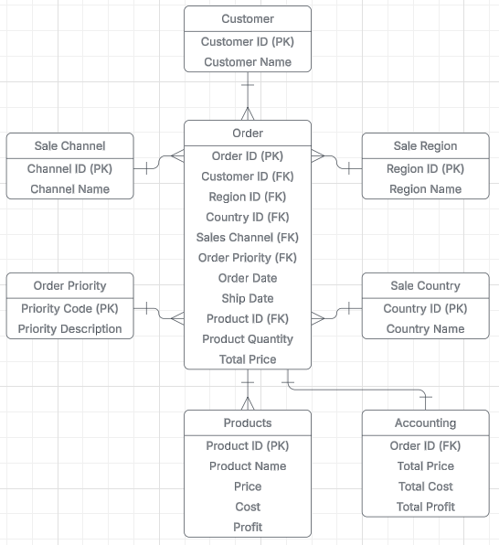

## EcoMart Sales Analysis & Relational Database Design

### Business Impact & Recommendations
This analysis of EcoMart's sales data produced two critical insights that led to clear, actionable recommendations for improving profitability and driving growth.

**Key Insights:**
* **Underperforming Region:** **North America** shows significantly lower performance compared to other sales regions.
* **Least Profitable Category:** **'Fruit'** is the least profitable product category by a wide margin, posing a financial and logistical risk due to its perishable nature.

**Actionable Recommendations:**
1.  **Address the 'Fruit' Category:** The company should either **discontinue the product line** to cut losses or test a **significant price increase** to improve its profit margin, potentially aligning it with the more successful 'Vegetables' category.
2.  **Boost North American Sales:** It is recommended to launch a **targeted marketing campaign** and special offers specifically for the North American region to increase client activity and revenue.

---
### The Scenario:
EcoMart, a growing e-commerce store, needed to transition from a single spreadsheet to a scalable database solution. The goal was to analyze sales data to identify key business insights that would guide investment, product strategy, and expansion efforts.

---
### Technical Solution & Methods:
A **relational database** was designed and implemented using **PostgreSQL** to provide a secure and structured solution for EcoMart's sales data. The process involved:
* **Database Design:** Normalizing the initial flat file to Second Normal Form (2NF) to reduce data redundancy.
* **Implementation:** Writing SQL scripts to create the database schema and tables.
* **Analysis & Visualization:** Developing SQL queries to analyze sales data and building an interactive dashboard in **Tableau**.

**Tools Used:**
* **Database:** PostgreSQL
* **Language:** SQL
* **Data Visualization:** Tableau

---
### Supporting Files & Visualizations:
* 
* [View SQL Database Creation Script](./DB.sql)
* [View SQL Analysis Queries](./analysis.sql)
* [View Interactive EcoMart Analysis Dashboard in Tableau](https://public.tableau.com/views/EcoMartAnalysisWGU-MSDA/Dashboard1?:language=en-US&:sid=&:redirect=auth&:display_count=n&:origin=viz_share_link)
