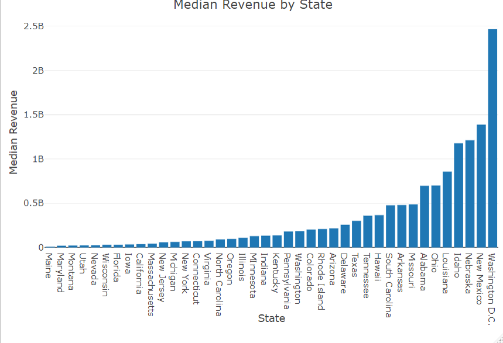

The Scenario:

A small investment company needs to gain deeper insights into its client portfolio.  The firm's current client data is stored in a single spreadsheet, and they need a systematic way to 
analyze it to make informed investment decisions. Key objectives include understanding client performance by geographic region, identifying high-risk clients with poor financial health, 
and calculating crucial financial metrics to evaluate investment potential. 

The Solution:

To provide these insights, a program was developed in R to perform a multi-step analysis. The process begins by importing and cleaning the raw client data, ensuring accuracy by identifying 
and removing any duplicate entries.  Following this, the program executes three distinct analyses into separate, organized data frames:

State-Level Analysis: Groups clients by state to calculate descriptive statistics (mean, median, min, max) for all numerical data, highlighting regional performance. 

Risk Identification: Filters the data to create a list of all businesses with a negative debt-to-equity ratio, flagging companies whose liabilities exceed their assets. 

Financial Health Calculation: Computes a new debt-to-income ratio for every client, providing a key metric used by lenders to assess a company's ability to repay debt. 

Finally, the results are presented through a series of custom data visualizations to make the findings clear and actionable for the stakeholders.

Tools Used:

Programming Language: R

R Packages:

readxl: For importing the initial Excel data. 

dplyr: For core data manipulation and analysis functions. 

janitor: For cleaning and formatting data frame column names. 

plotly: For creating customized data visualizations. 

[View the Full R Script](./analysis.R)

Key Visualizations:

Shows which states bring in the most revenue:

Shows key metrics for clients that have a negative Debt-to-Equity Ratio:

Explores a potential relationship between client Revenue and Long-Term Debt:

Explores the distribution of Debt-to-Equity Ratios:

Results:

The analysis yielded four key visual outputs that provide a comprehensive overview of the client portfolio:

Regional Performance: The Median Revenue by State bar chart clearly identifies which geographical regions contain the most financially successful clients.

High-Risk Clients: A detailed bar chart presents key financial metrics (debt, equity, liabilities, revenue) for all clients with a negative debt-to-equity ratio, isolating them for immediate review. 

Debt & Revenue Relationship: The Revenue vs. Long-Term Debt scatter plot reveals the general trend between borrowing and earning among the clients.

Portfolio Health Distribution: A histogram of Debt-to-Equity Ratios shows the overall distribution of financial risk across the entire client base.

Conclusion:
This analysis successfully transformed a raw dataset into a powerful decision-support tool. 
The generated data frames and visualizations provide the investment company with a clear, data-driven foundation to manage risk by flagging unstable companies and to identify opportunities by 
highlighting financially healthy clients.
